# commercial_pool_20260908-173026 Phase4B stress

## batch1

# Wire stress results

- Config: `/home/fyp1/work/multi-flow-rate-control/scripts/local/stress_linear_4b_batch1_copy_mixed.json`
- Result dir: `/home/fyp1/work/multi-flow-rate-control/build/wire-stress-commercial_pool_20260908-173026-4b-batch1`
- Streams: 6 (6 PASS / 0 FAIL)
- Receiver groups: 3 (one process per to+codec)
- Sender groups: 5
- idle_sec_base=20 port_base=9200

## Node CPU / NIC

- **node1**: NIC peak 382.2 / avg 247.5 Mbps
- **node2**: NIC peak 456.5 / avg 271.2 Mbps
- **node3**: NIC peak 456.6 / avg 241.5 Mbps
- **node4**: NIC peak 318.8 / avg 234.2 Mbps

### Peak summary

| node | CPU peak % | RX peak Mbps | TX peak Mbps |
| --- | ---: | ---: | ---: |
| node1 | 26.1 | 0.0 | 382.2 |
| node2 | 30.7 | 382.2 | 456.5 |
| node3 | 12.3 | 456.6 | 318.6 |
| node4 | 10.9 | 318.8 | 0.0 |

### CPU overlay

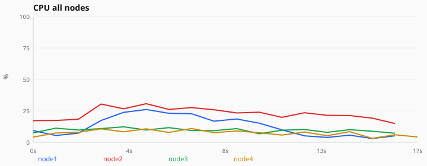

### node1

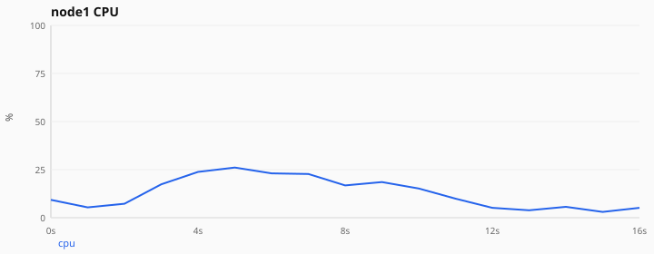

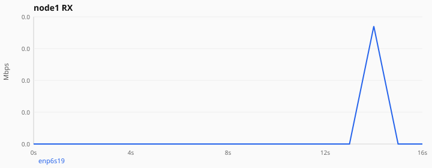

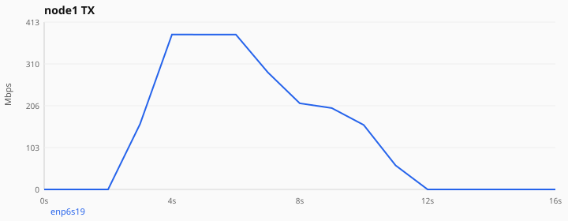

### node2

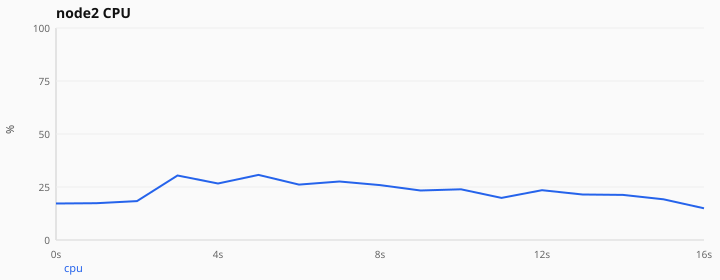

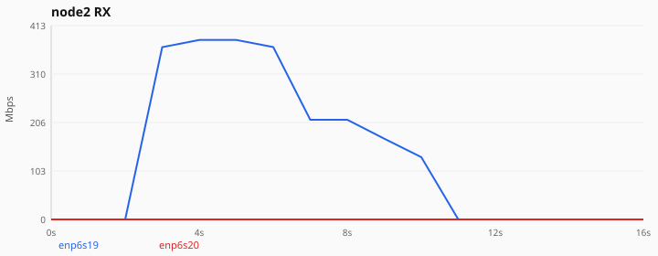

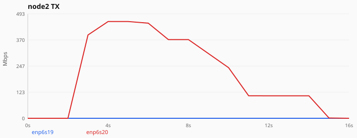

### node3

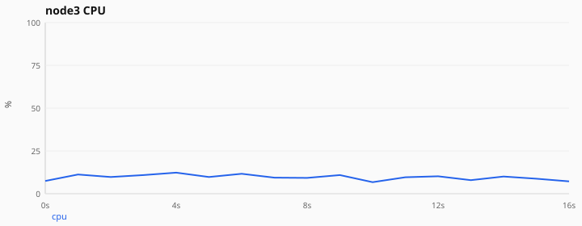

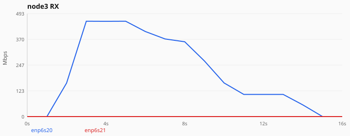

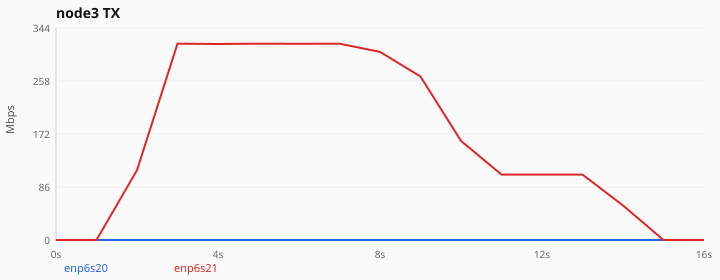

### node4

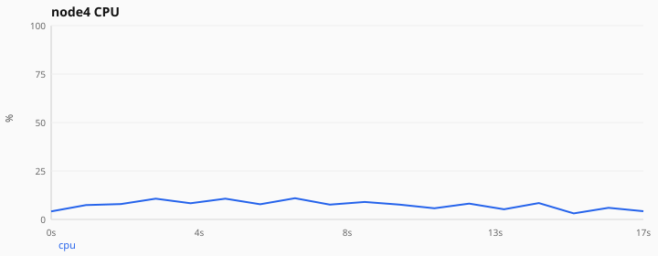

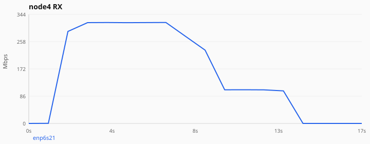

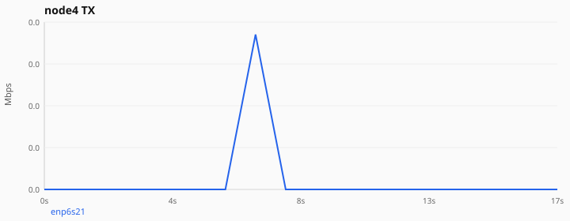

## Streams

`flow` = config order (1..N). `wire_id` = UDP wire flow_id inside that receiver process (0..7; may repeat on different nodes/codecs).

| flow | path | rate | codec | wire_id | recv port | status | note |
| ---: | --- | ---: | --- | ---: | ---: | --- | --- |
| 1 | node1→node4 | 150 | copy | 0 | 9200 | PASS | out_src_10.20.20.1_p46197_flow_0.ts |
| 2 | node2→node4 | 100 | copy | 1 | 9200 | PASS | out_src_10.30.30.1_p52330_flow_1.ts |
| 3 | node1→node2 | 80 | copy | 0 | 9201 | PASS | out_ |
| 4 | node1→node3 | 80 | copy | 0 | 9202 | PASS | out_src_10.20.20.1_p53704_flow_0.ts |
| 5 | node2→node3 | 50 | copy | 1 | 9202 | PASS | out_src_10.30.30.1_p37721_flow_1.ts |
| 6 | node1→node4 | 50 | copy | 2 | 9200 | PASS | out_src_10.20.20.1_p50922_flow_2.ts |

## Process groups

### Receivers

- `node4` codec=`copy` port=`9200` idle=51s flows=[1,2,6] wire_ids=[0,1,2]
- `node2` codec=`copy` port=`9201` idle=43s flows=[3] wire_ids=[0]
- `node3` codec=`copy` port=`9202` idle=46s flows=[4,5] wire_ids=[0,1]

### Senders

- `node1` codec=`copy` → `10.40.40.2:9200` flows=[1,6]
- `node2` codec=`copy` → `10.40.40.2:9200` flows=[2]
- `node1` codec=`copy` → `10.20.20.2:9201` flows=[3]
- `node1` codec=`copy` → `10.30.30.2:9202` flows=[4]
- `node2` codec=`copy` → `10.30.30.2:9202` flows=[5]

## batch2

# Wire stress results

- Config: `/home/fyp1/work/multi-flow-rate-control/scripts/local/stress_linear_4b_batch2_copy_sink4.json`
- Result dir: `/home/fyp1/work/multi-flow-rate-control/build/wire-stress-commercial_pool_20260908-173026-4b-batch2`
- Streams: 6 (6 PASS / 0 FAIL)
- Receiver groups: 1 (one process per to+codec)
- Sender groups: 3
- idle_sec_base=20 port_base=9300

## Node CPU / NIC

- **node1**: NIC peak 159.2 / avg 128.3 Mbps
- **node2**: NIC peak 530.9 / avg 245.5 Mbps
- **node3**: NIC peak 743.3 / avg 393.0 Mbps
- **node4**: NIC peak 743.3 / avg 491.1 Mbps

### Peak summary

| node | CPU peak % | RX peak Mbps | TX peak Mbps |
| --- | ---: | ---: | ---: |
| node1 | 18.6 | 0.0 | 159.2 |
| node2 | 47.6 | 159.3 | 530.9 |
| node3 | 25.3 | 530.9 | 743.3 |
| node4 | 28.9 | 743.3 | 0.0 |

### CPU overlay

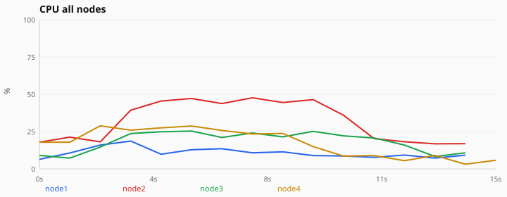

### node1

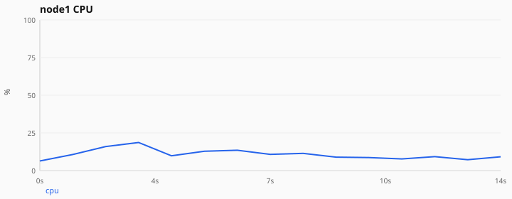

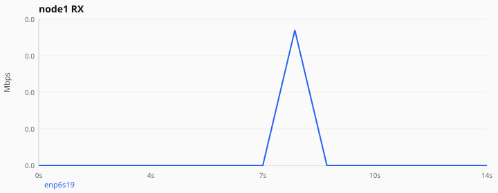

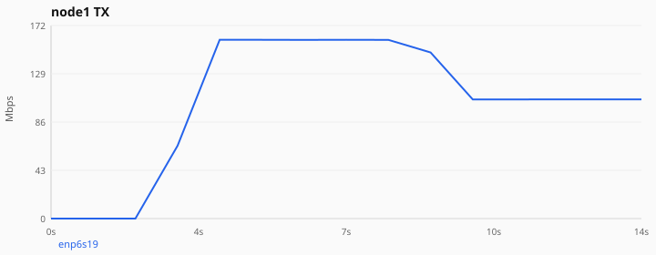

### node2

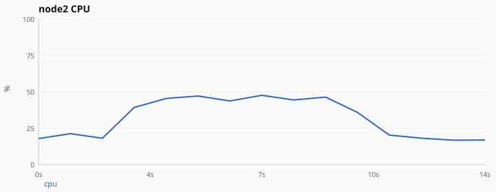

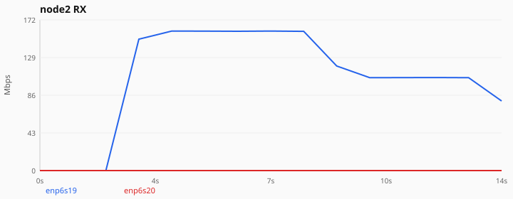

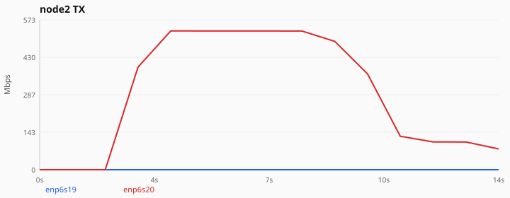

### node3

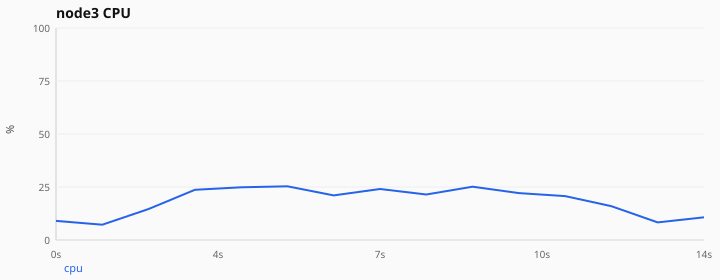

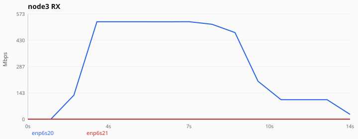

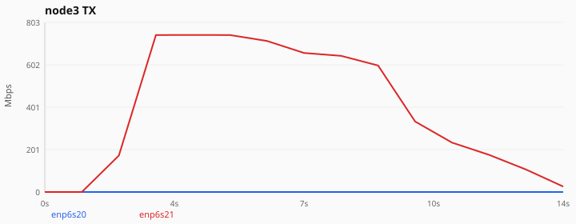

### node4

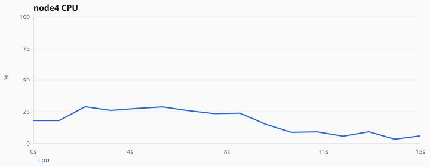

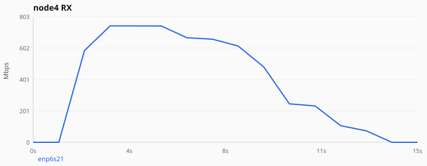

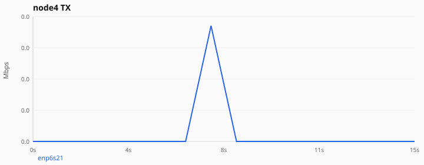

## Streams

`flow` = config order (1..N). `wire_id` = UDP wire flow_id inside that receiver process (0..7; may repeat on different nodes/codecs).

| flow | path | rate | codec | wire_id | recv port | status | note |
| ---: | --- | ---: | --- | ---: | ---: | --- | --- |
| 1 | node1→node4 | 50 | copy | 0 | 9300 | PASS | out_src_10.20.20.1_p58865_flow_0.ts |
| 2 | node1→node4 | 100 | copy | 1 | 9300 | PASS | out_src_10.20.20.1_p56952_flow_1.ts |
| 3 | node2→node4 | 150 | copy | 2 | 9300 | PASS | out_src_10.30.30.1_p55622_flow_2.ts |
| 4 | node2→node4 | 200 | copy | 3 | 9300 | PASS | out_src_10.30.30.1_p60539_flow_3.ts |
| 5 | node3→node4 | 80 | copy | 4 | 9300 | PASS | out_src_10.40.40.1_p54606_flow_4.ts |
| 6 | node3→node4 | 120 | copy | 5 | 9300 | PASS | out_src_10.40.40.1_p33395_flow_5.ts |

## Process groups

### Receivers

- `node4` codec=`copy` port=`9300` idle=51s flows=[1,2,3,4,5,6] wire_ids=[0,1,2,3,4,5]

### Senders

- `node1` codec=`copy` → `10.40.40.2:9300` flows=[1,2]
- `node2` codec=`copy` → `10.40.40.2:9300` flows=[3,4]
- `node3` codec=`copy` → `10.40.40.2:9300` flows=[5,6]

## batch3

# Wire stress results

- Config: `/home/fyp1/work/multi-flow-rate-control/scripts/local/stress_linear_4b_batch3_wirehair_ack_mixed.json`
- Result dir: `/home/fyp1/work/multi-flow-rate-control/build/wire-stress-commercial_pool_20260908-173026-4b-batch3`
- Streams: 6 (6 PASS / 0 FAIL)
- Receiver groups: 3 (one process per to+codec)
- Sender groups: 5
- idle_sec_base=25 port_base=9400

## Node CPU / NIC

- **node1**: NIC peak 288.3 / avg 203.9 Mbps
- **node2**: NIC peak 350.4 / avg 212.4 Mbps
- **node3**: NIC peak 350.4 / avg 197.5 Mbps
- **node4**: NIC peak 247.3 / avg 166.4 Mbps

### Peak summary

| node | CPU peak % | RX peak Mbps | TX peak Mbps |
| --- | ---: | ---: | ---: |
| node1 | 10.3 | 0.0 | 288.3 |
| node2 | 26.7 | 288.4 | 350.4 |
| node3 | 19.2 | 350.4 | 247.2 |
| node4 | 10.3 | 247.3 | 0.0 |

### CPU overlay

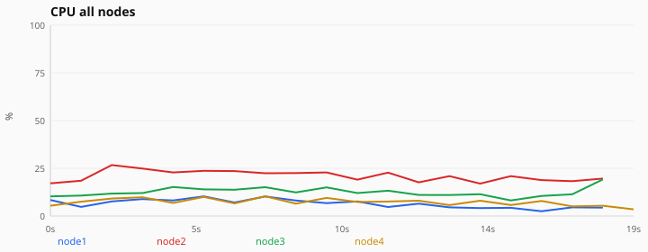

### node1

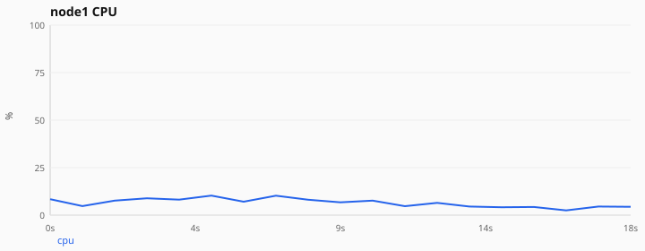

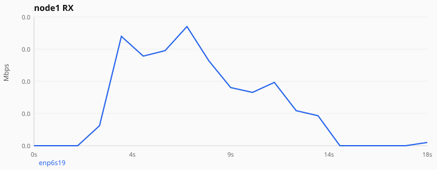

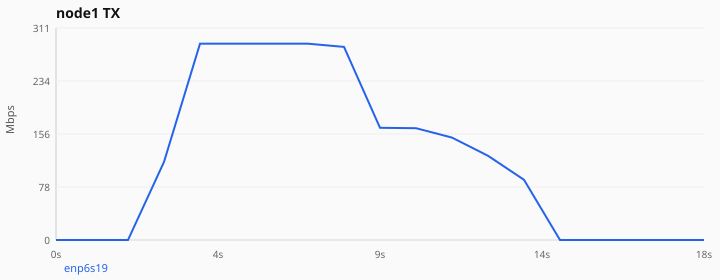

### node2

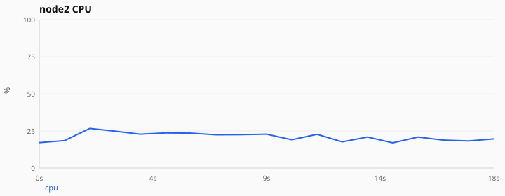

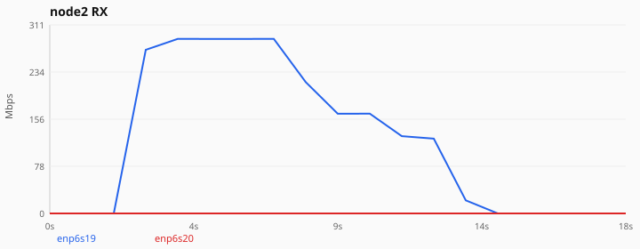

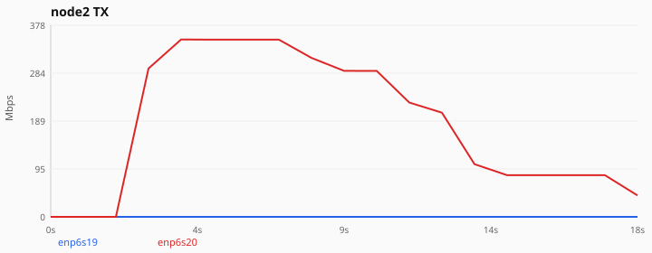

### node3

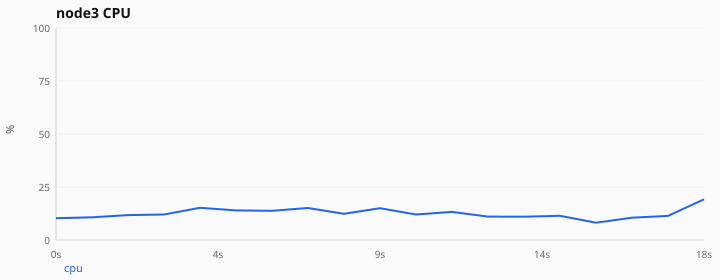

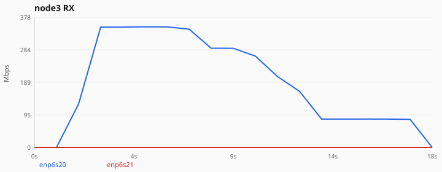

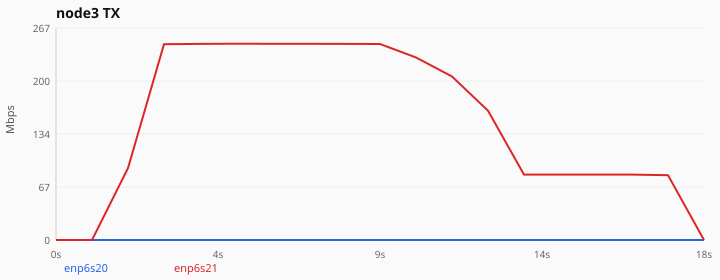

### node4

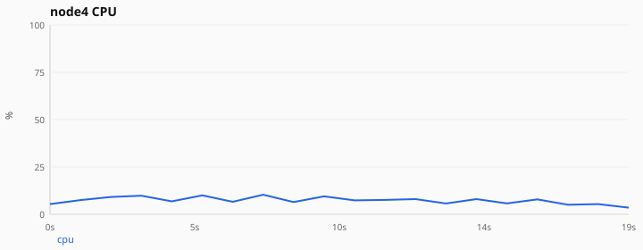

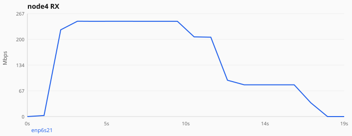

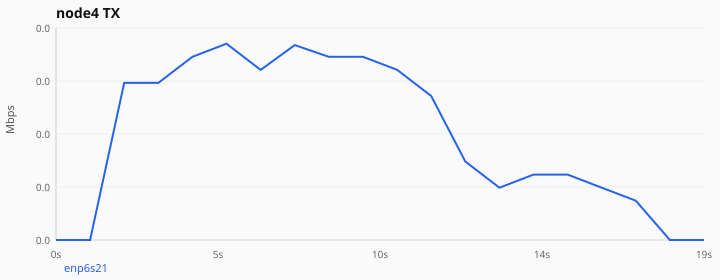

## Streams

`flow` = config order (1..N). `wire_id` = UDP wire flow_id inside that receiver process (0..7; may repeat on different nodes/codecs).

| flow | path | rate | codec | wire_id | recv port | status | note |
| ---: | --- | ---: | --- | ---: | ---: | --- | --- |
| 1 | node1→node4 | 120 | wirehair | 0 | 9400 | PASS | out_src_10.20.20.1_p45431_flow_0.ts |
| 2 | node2→node4 | 80 | wirehair | 1 | 9400 | PASS | out_src_10.20.20.1_p45431_flow_0.ts |
| 3 | node1→node2 | 60 | wirehair | 0 | 9401 | PASS | out_ |
| 4 | node1→node3 | 60 | wirehair | 0 | 9402 | PASS | out_src_10.20.20.1_p59028_flow_0.ts |
| 5 | node2→node3 | 40 | wirehair | 1 | 9402 | PASS | out_src_10.20.20.1_p59028_flow_0.ts |
| 6 | node1→node4 | 40 | wirehair | 2 | 9400 | PASS | out_src_10.20.20.1_p58679_flow_2.ts |

## Process groups

### Receivers

- `node4` codec=`wirehair` port=`9400` idle=59s flows=[1,2,6] wire_ids=[0,1,2]
- `node2` codec=`wirehair` port=`9401` idle=50s flows=[3] wire_ids=[0]
- `node3` codec=`wirehair` port=`9402` idle=52s flows=[4,5] wire_ids=[0,1]

### Senders

- `node1` codec=`wirehair` → `10.40.40.2:9400` flows=[1,6]
- `node2` codec=`wirehair` → `10.40.40.2:9400` flows=[2]
- `node1` codec=`wirehair` → `10.20.20.2:9401` flows=[3]
- `node1` codec=`wirehair` → `10.30.30.2:9402` flows=[4]
- `node2` codec=`wirehair` → `10.30.30.2:9402` flows=[5]
